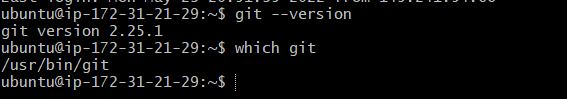
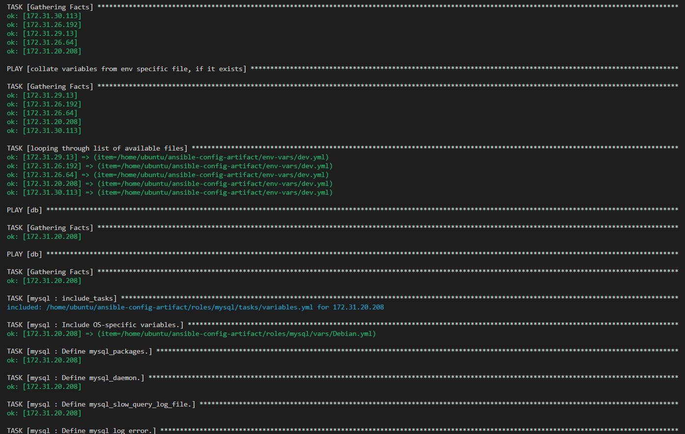
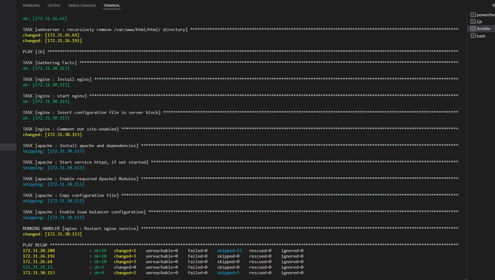
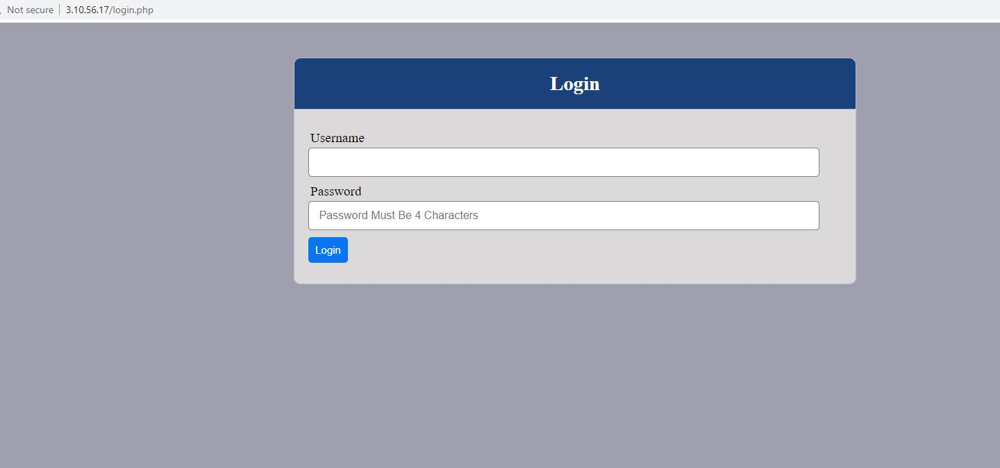
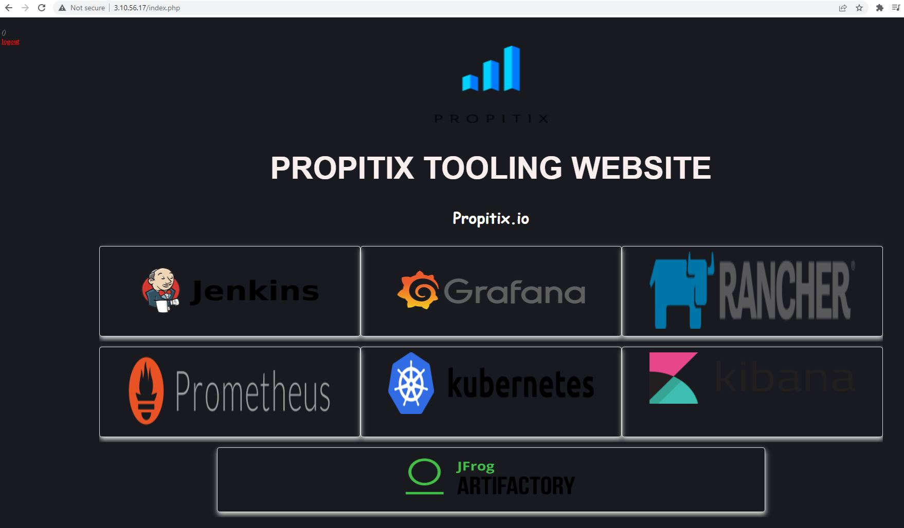

## ANSIBLE DYNAMIC ASSIGNMENTS (INCLUDE) AND COMMUNITY ROLES  
---  

- In my github repository, I started a new branch named dynamic-assignments

```
git checkout -b dynamic-assignments
```
- I created a new folder and named it dynamic-assignments. Inside this folder, I created a new file and name it env-vars.yml. I will instruct site.yml to include this playbook.

```
mkdir dynamic-assignments && touch dynamic-assignments/env-vars.yml
```

- Next is to configure ansible to use multiple environments. It is neccessary to create a folder to keep each environment's variable files.  

- I created a new folder env-vars and inside it, for each environment, new YAML files to set up variables

```
mkdir env-vars && touch env-vars/dev.yml env-vars/stage.yml env-vars/uat.yml env-vars/prod.yml
```  

- I posted the following code snippet into env-vars.yaml

```
---
- name: collate variables from env specific file, if it exists
  hosts: all
  tasks:
    - name: looping through list of available files
      include_vars: "{{ item }}"
      with_first_found:
        - files:
            - dev.yml
            - stage.yml
            - prod.yml
            - uat.yml
          paths:
            - "{{ playbook_dir }}/../env-vars"
      tags:
        - always

```  

- Next, I updated site.yml with dynamic assignments as below  

```
---
- hosts: all
- name: Include dynamic variables 
  tasks:
  import_playbook: ../static-assignments/common.yml 
  include: ../dynamic-assignments/env-vars.yml
  tags:
    - always

-  hosts: webservers
- name: Webserver assignment
  import_playbook: ../static-assignments/webservers.yml

```  


- Next I downloaded and installed a MySQL role developed by geerlingguy

- On my ansible-jenkins server, I checked if git was installed 

```
git --version
which git
```
  

- Then I went to the ansible-config-artifact directory to initialise and create a branch

```
git init
git pull https://github.com/DrSaas/projectjenkins11.git
git remote add origin https://github.com/DrSaas/projectjenkins11.git
git branch roles-feature
git switch roles-feature
```


- Inside roles directory,  I created a new MySQL role with ansible-galaxy install geerlingguy.mysql and renamed the folder to mysql  

```
ansible-galaxy install geerlingguy.mysql

mv geerlingguy.mysql/ mysql
```

I commited and pushed the changes to GitHub:
```
git add .
git commit -m "Commit new role files into GitHub"
git push --set-upstream origin roles-feature
```
- I was unable to push to git as username/password prompt failed. Password authentication disabled since 2021.

- Solution:   I created a personal access token in git and used it as the password with expiry set to 90 days

- settings 
  - developer
    - Personal access tokens
       - Generate new token
          - I gave a descriptive name
          - set expiration to 90 days
          - selected the scope (repo, admin:repo_hook, delete_repo)  

- I generated the token and used it as a password.
- I was able to push successfully.
```
Username: drsaas
Password: my_token
```

- I edited mysql > defaults > main.yml file with the toolng database credentials
```
# Databases.
mysql_databases:
  - name: tooling
    collation: utf8_general_ci
    encoding: utf8
    replicate: 1

# Users.
mysql_users: 
  - name: webaccess
    host: 0.0.0.0
    password: secret
    priv: '*.*:ALL,GRANT'

```


- Load Balancer Roles 
- Next i created the Nginx role from geerlingguy


```
ansible-galaxy install geerlingguy.nginx

mv geerlingguy.nginx/ nginx
```

- I created the apache role
```
ansible-galaxy install geerlingguy.apache

mv geerlingguy.apache/ apache
```

- Next was to configure the inventory/uat.yml file

```

[nfs]
172.31.29.13 ansible_ssh_user='ec2-user'

[webservers]
172.31.26.192 ansible_ssh_user='ec2-user'
172.31.26.64 ansible_ssh_user='ec2-user'

[db]
172.31.20.208 ansible_ssh_user='ubuntu'

[lb]
172.31.30.113 ansible_ssh_user='ubuntu'


```

- I made changes to nginx > default > main.yml

```
nginx_upstreams: 
- name: myapp1
  strategy: "ip_hash" # "least_conn", etc.
  keepalive: 16 # optional
  servers:
    - "172.31.26.192 weight=3"
    - "172.31.26.64 weight=3"
```

```
nginx_extra_http_options: 
Example extra http options, printed inside the main server http config:
   nginx_extra_http_options: |
     proxy_buffering    off;
     proxy_set_header   X-Real-IP $remote_addr;
     proxy_set_header   X-Scheme $scheme;
     proxy_set_header   X-Forwarded-For $proxy_add_x_forwarded_for;
     proxy_set_header   Host $http_host;

```


- In nginx > tasks > main.yml, I set become: true for #Nginx setup

```
# Nginx setup.
- name: Copy nginx configuration in place.
  become: true
  template:
    src: "{{ nginx_conf_template }}"
    dest: "{{ nginx_conf_file_path }}"
    owner: root
    group: "{{ root_group }}"
    mode: 0644
  notify:
    - reload nginx

- name: Ensure nginx service is running as configured.
  become: true
  service:
    name: nginx
    state: "{{ nginx_service_state }}"
    enabled: "{{ nginx_service_enabled }}"


```


- Next I added the following to apache > defaults > main.yml

```
# Defaults for apache role

enable_apache_lb: false
load_balancer_is_required: false


# DNS mapping for Webservers

web1: 172.31.26.192
web2: 172.31.26.64
 

```

- In the apache role , I navigated to apache > tasks > setupredhat.yml  and set become: yes

```
- name: Ensure Apache is installed on RHEL.
  become: yes 
  package:
    name: "{{ apache_packages }}"
    state: "{{ apache_packages_state }}"
    enablerepo: "{{ apache_enablerepo | default(omit, true) }}"


```
- This snippet also added to setupredhat.yml to handle selinux

```
- name: Set httpd_can_network_connect flag on and keep it persistent across reboots
  ansible.posix.seboolean:
    name: httpd_can_network_connect
    state: yes
    persistent: yes

```

---
- In apache > defaults > main.yml
---
```
enable_apache_lb: false

load_balancer_is_required: false

# Webservers

web1: 172.31.26.192
web2: 172.31.26.64
 
```
---
- In nginx > tasks > setupredhat.yml I added the following snippet
---
```
---
- name: Enable nginx repo.
  become: yes
  template:
    src: nginx.repo.j2
    dest: /etc/yum.repos.d/nginx.repo
    owner: root
    group: "{{ root_group }}"
    mode: 0644
  when: nginx_yum_repo_enabled | bool

- name: Ensure nginx is installed.
  become: yes
  package:
    name: "{{ nginx_package_name }}"
    state: present

```
- In Nginx > tasks > main.yml 

```
---

- name: Install nginx
  become: yes
  apt:
    name: nginx
    state: present


- name: start nginx
  become: yes
  service:
    name: nginx
    state: started

- name: Insert configuration file in server block
  become: yes
  blockinfile:
     path: /etc/nginx/nginx.conf
     block: "{{ lookup('file', '../templates/nginx.conf' ) }}"
     insertafter: "http {"


- name: Comment out site-enabled
  become: yes
  replace:
     path: /etc/nginx/nginx.conf
     regexp: '(.*enabled.*)'
     replace: '#\1'
         
  notify: Restart nginx service


```

- The hostname is referenced in nginx>defaults>main.yml
```
enable_nginx_lb: false
load_balancer_is_required: false

# Webservers

web1: 172.31.26.192
web2: 172.31.26.64
```


---
- I declared 2 variables enable_nginx_lb and enable_apache_lb in defaults/main.yml of Nginx and Apache roles respectively and set both to false.
- I declared another variable in both roles load_balancer_is_required and set its value to false as well  
---
```
enable_nginx_lb: false

load_balancer_is_required: false
```


```
enable_apache_lb: false

load_balancer_is_required: false
```

Update both assignment and site.yml files respectively


- I updated static-assignments (db.yml)

```
---
- hosts: db
  roles:
     - mysql
  become: true

```

- I updated static-assignments (webservers.yml)

```
---
- hosts: webservers
  roles:
     - webserver
  become: true
```


- I updated static-assignments (lb.yml)

```
---
- hosts: lb
  roles:
    - { role: nginx, when: enable_nginx_lb and load_balancer_is_required }
    - { role: apache, when: enable_apache_lb and load_balancer_is_required }
```

-  Then I updated playbooks/site.yml which is the entry point
```
---
- name: Include dynamic variables 
  hosts: all

- name: import common file
  import_playbook: ../static-assignments/common.yml
  tags:
    - always

- name: include env-vars file
  import_playbook: ../dynamic-assignments/env-vars.yml
  tags:
    - always

- name: import database file
  import_playbook: ../static-assignments/db.yml

- name: import webservers file
  import_playbook: ../static-assignments/webservers.yml

- name: import Loadbalancers assignment
  import_playbook: ../static-assignments/lb.yml
  when: load_balancer_is_required 
```

- I updated env-vars > uat.yml
- This will be used to control the loadbalancers

```
enable_nginx_lb: true
load_balancer_is_required: true

```

---
- Next task is to run the playbook with preferred load balancer as nginx
---
```
ansible-playbook -i /inventory/uat.yml /playbooks/site.yml

```
---
- Webservers are up and running
---








---
- Loadbalancer is functional
---


---
End of Project

---
