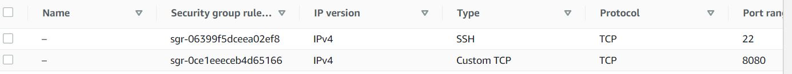
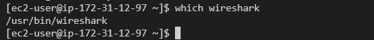

## Project 11 Documentation
---
### We launched the following instances:

#### 3 RHEL Instances

* Webserver-1
*  Webserver-2
* NFS

#### 3 Ubuntu Instances

* LB
* DB
* Jenkins-Ansible


---
## Then I installed and configured Ansible and Jenkins on the Jenkins-Ansible server
---

#### Update the jenkins server 
```
sudo apt update
```
#### Install the Java Development Kit and dependencies 
```
sudo apt install default-jdk-headless
```

#### Install Jenkins
```
wget -q -O - https://pkg.jenkins.io/debian-stable/jenkins.io.key | sudo apt-key add -
sudo sh -c 'echo deb https://pkg.jenkins.io/debian-stable binary/ > \
    /etc/apt/sources.list.d/jenkins.list'

sudo apt update
sudo apt-get install jenkins
```
#### Jenkins successfully installed


```
sudo systemctl status jenkins
```


#### Next I opened port 8080 inthe Jenkins-Ansible security group as it is the port that Jenkins uses.  




Next I loaded the jenkins page in the web browser
http://18.134.3.98:8080        


  

Next, I got the password from /var/lib/jenkins/secrets/initialAdminPassword and set up Jenkins on the web browser        


    


```
sudo cat /var/lib/jenkins/secrets/initialAdminPassword
```

---
## Install and configure Ansible on the Ansible-Jenkins Instance/Server
---

```
sudo apt update
sudo apt install ansible -y
```

### Check ansible version  
```
ansible --version
```

  


## The next step was to customize Jenkins. I selected the Install suggested plugins option  
---  


  

---
## The next step was to configure Jenkins to retrieve source codes from GitHub using Webhooks
---  

### I created a github repository called project-ansible  

### I enabled webhook in the github repository settings


### created a freestyle project called ansible in Jenkins

### In configuration of the Jenkins freestyle project (Ansible) , I choose Git repository

### I then entered the url of my git repository

### I changed the branch to build from master to main

### I saved and ran the build which was successful  


### The next step was to configure Jenkins so that the build is automated - triggered from a github webhook  


### I selected the GitHub hook trigger for GITScm polling option checkbox  


### I then set the post build actions to archive the artifacts


### The next step was to push changes from VS Code to Github and see if build #4 will be triggered by the webhook


### I proceeded to check if the artifacts of build #4 were stored on the jenkins server at /var/lib/jenkins/jobs/ansible/builds/4/archive/

```
ls /var/lib/jenkins/jobs/ansible/builds/4/archive/
```
  


### The artifacts were successfully stored on the  Jenkins server  

### end of jenkins configuration  

##Next is to create a new branch testbranch  to our repository 

```
git branch

git status

git checkout -b testbranch
```

### I created the directory structure aand files 
playbooks
 - common.yml
inventory
 - dev.yml   
 - staging.yml   
 - uat.yml  
 - prod.yml  

```
mkdir playbooks && touch playbooks/common.yml

mkdir inventory && touch inventory/dev.yml inventory/staging.yml inventory/uat.yml inventory/prod.yml
```

### I updated the inventory/dev.yml file with the code snippet below
```
[nfs]
172.31.2.41 ansible_ssh_user='ec2-user'

[webservers]
172.31.12.97 ansible_ssh_user='ec2-user'
172.31.6.178 ansible_ssh_user='ec2-user'

[db]
172.31.15.148 ansible_ssh_user='ec2-user' 

[lb]
172.31.9.227 ansible_ssh_user='ubuntu'
```

The next step was to set up ssh agent

```
eval `ssh-agent -s`

```
ssh-add path-to-private-key
```
ssh-add PBL.pem
```
### ssh -A ubuntu@ instance-public-ip-addess
```
ssh -A ubuntu@18.132.200.175
```
### persist key on server

```
ssh-add -l
```


## In playbooks/common.yml playbook,  I updated it with the following code containing the configuration for repeatable, re-usable, and multi-machine tasks that is common to systems within the infrastructure.


```
---
- name: update web, nfs and db servers
  hosts: webservers, nfs, db
  remote_user: ec2-user
  become: yes
  become_user: root
  tasks:
    - name: ensure wireshark is at the latest version
      yum:
        name: wireshark
        state: latest

- name: update LB server
  hosts: lb
  remote_user: ubuntu
  become: yes
  become_user: root
  tasks:
    - name: Update apt repo
      apt: 
        update_cache: yes

    - name: ensure wireshark is at the latest version
      apt:
        name: wireshark
        state: latest

```

### Next step was to push all changes in branch testbranch to the githup repository

```
git add .

git commit -m "updated playbook and inventory files"

git push origin testbranch
```
### Next I created a pull request on github

  

### I merged the changes in testbranch to main

 

Then I closed the pull request after merging

 

### I proceeded to check that the build was automatically triggered in Jenkins  

 

### I also checked that jenkins had saved the artifacts on the server (build #10)
### at /var/lib/jenkins/jobs/ansible/builds/10/archive/

```
ls /var/lib/jenkins/jobs/ansible/builds/10/archive/

```


 

## Run first ansible test
---

### I connect to the host using remote SSH

ssh - A ubuntu@18.132.200.175

### successfully connected remotel to server

### open folders on server

### run playbook on build #10
```
ansible-playbook -i  /var/lib/jenkins/jobs/ansible/builds/10/archive/inventory/dev.yml /var/lib/jenkins/jobs/ansible/builds/10/archive/playbooks/common.yml   
```


 


### I did an SSH into the other instances to confirm that wireshark was successfully installed.
### Webserver 1

  

### Webserver 2


### Next, I added new instructions to the playbook common.yml to create a directory called sample and 
### create a file called ansible.txt

### I added the code snippet below to the existing common.yml

```
- name: create directory, file ans set timezone on all servers
  hosts: webservers, nfs, db, lb
  become: yes
  tasks:
    - name: create a directory
      file:
        path: /home/sample
        state: directory
   
    - name: create a file
      file:
        path: /home/sample/ansible.txt
        state: touch

    - name: change timezone
      timezone:
        name: Africa/Lagos

```
---


### I then checked to see if the new instructions had executed successfully and creted the folder and file


---
# End of Project
---