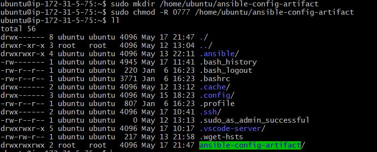
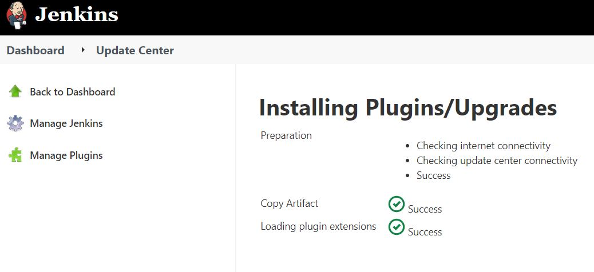
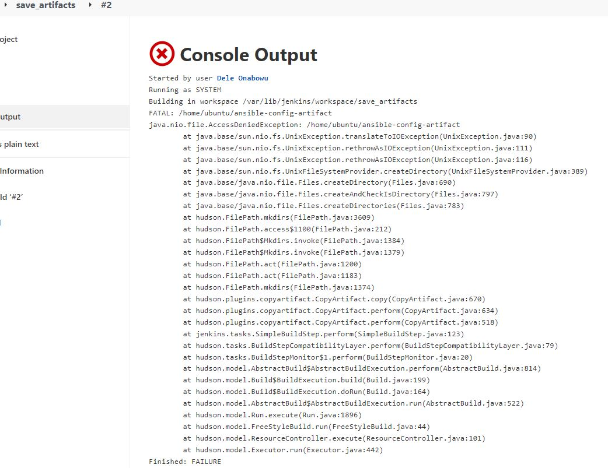
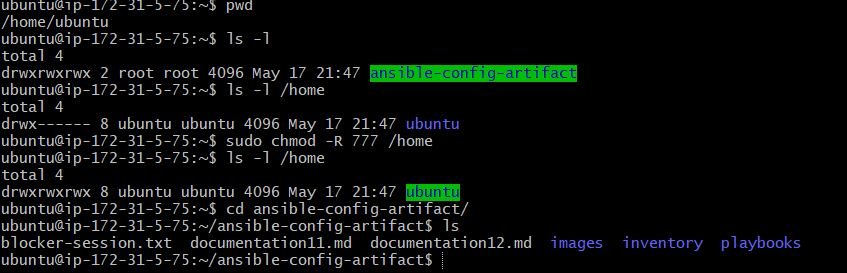
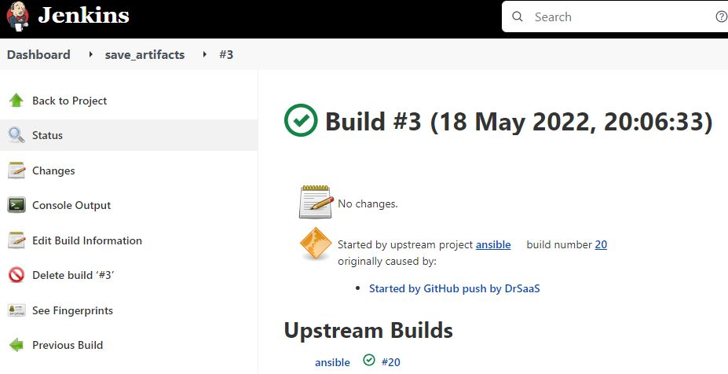
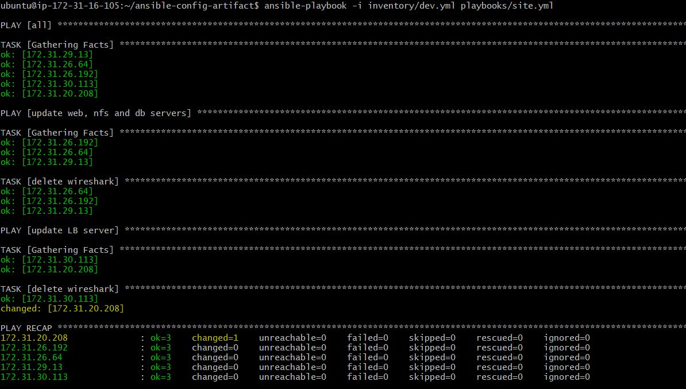
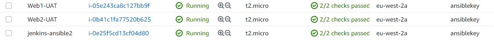
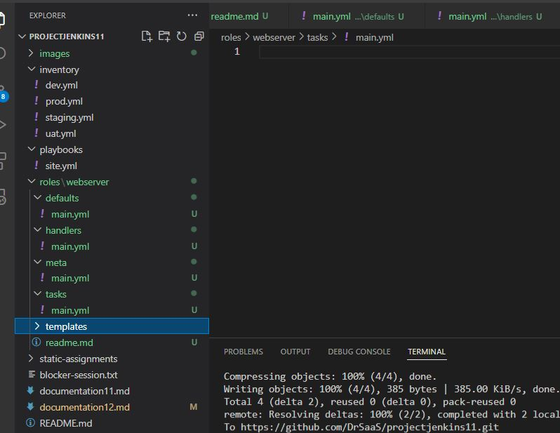
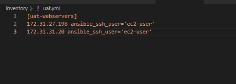
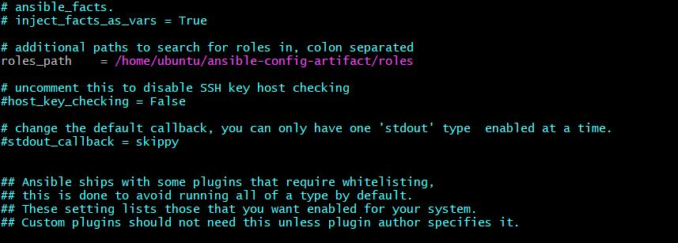

Project 12
----------------------------

### Jenkins job enhancement

### I SSH'd into the Jenkins-Ansible-Server to create a directory named ansible-config-artifact

```

sudo chown root:root /home
sudo chmod 755 /home
sudo chown ubuntu:ubuntu /home/ubuntu -R
$ sudo chmod 700 /home/ubuntu /home/ubuntu/.ssh
$ sudo chmod 600 /home/ubuntu/.ssh/authorized_keys

sudo mkdir /home/ubuntu/ansible-config-artifact

sudo chmod -R 0777 /home/ubuntu/ansible-config-artifact

```
I ran ll to check permissions and owner

```
ll
```


  

### Next step was to download the copy artifactc plugin in Jenkins

 

### I created a new Freestyle project and named it save_artifacts.

### This project will be triggered by completion of the existing ansible project. 
# change

### I created a new item and configured it as such

- I checked the Discard old builds checkbox
- Set the Max # of builds to 2
- Left source code management as None
- Under Build Triggers, I selected Build after other projects are built
- For Projects to watch, I selected the previous project called ansible
- I created a build step and selected copy artifacts from another project
- For project name, I selected ansible
- Artifacts to copy was set as ** 
- For artifacts not to copy, I entered README.md
- Target directory was set as /home/ubuntu/ansible-config-artifact

### I pushed the changes made to git to check if the setup was working correctly

### The save artifacts build faled with the error  below



### I did a chmod -R 777 against /home

 

 

Chmod -R 777 home caused problems. Unable to SSH into instance after that.
### I changed the owner of the artifacts file to ubuntu and tried again
### Still didn't work
### Deleted and created the directory again with chmod 777
### Still didn't work
### Added a slash after the full path  /home/ubuntu/ansible-config-artifact/
### Still didn't work
### remove the , from ansible in jenkins

Eventually we used
```
sudo chmod -R 0777 /home/ubuntu/ansible-config-artifact
sudo chmod 0775 /home/ubuntu/
```
### I created a new branch refactor
```
git checkout -b refactor
```
### I created a file site.yml in the plybooks directory

```
touch playbooks/site.yml
```
#### I created a directory static-assignments in the root
```
mkdir static-assignments
```
### I moved common.yml file into the newly created static-assignments folder
```
mv playbooks/common.yml static-assignments/
```
### Inside site.yml file, import common.yml playbook.
```
---
- hosts: all
- import_playbook: ../static-assignments/common.yml
```

### Next stepwas to create common-del.yml in ststic-assignments to delete wireshark

```
touch static-assignments/common-del.yml
```

### Common-del.yml is where I will configure the deletion of wireshark utility.

```

---
- name: update web, nfs and db servers
  hosts: webservers, nfs
  remote_user: ec2-user
  become: yes
  become_user: root
  tasks:
  - name: delete wireshark
    yum:
      name: wireshark
      state: removed

- name: update LB server
  hosts: lb,db
  remote_user: ubuntu
  become: yes
  become_user: root
  tasks:
  - name: delete wireshark
    apt:
      name: wireshark-qt
      state: absent
      autoremove: yes
      purge: yes
      autoclean: yes

```

### Wireshark successfully deleted


## The next task is to configure 2 UAT webservers with a role 'WEBSERVER'
###  I launched 2 fresh EC2 instances using RHEL 8 image,and named them Web1-UAT and Web2-UAT.
  

### I then created the roles directory in the root and the created the webserver file structure in the roles directory manually .  

  

### I proceeded to update the inventory ansible-config-artifact/inventory/uat.yml file with IP addresses of the 2 UAT Web servers




### Next, I went into tasks directory, and within the main.yml file and posted the instructions to do the following

### In /etc/ansible/ansible.cfg file, I uncommented roles_path string and provided the full path to the roles directory roles_path    = /home/ubuntu/ansible-config-artifact/roles, so Ansible could know where to find configured roles.




###  Next, I configured tasks/main.yml to do the following
- Install and configure Apache (httpd service)
- Clone Tooling website from GitHub https://github.com/darey-io/tooling.git.
- Ensure the tooling website code is deployed to /var/www/html on each of 2 UAT Web servers.
- Make sure httpd service is started

```
---
- name: install apache
  become: true
  ansible.builtin.yum:
    name: "httpd"
    state: present

- name: install git
  become: true
  ansible.builtin.yum:
    name: "git"
    state: present

- name: clone a repo
  become: true
  ansible.builtin.git:
    repo: https://github.com/darey-io/tooling.git
    dest: /var/www/html
    force: yes

- name: copy html content to one level up
  become: true
  command: cp -r /var/www/html/html/ /var/www/

- name: Start service httpd, if not started
  become: true
  ansible.builtin.service:
    name: httpd
    state: started

- name: recursively remove /var/www/html/html/ directory
  become: true
  ansible.builtin.file:
    path: /var/www/html/html
    state: absent
```